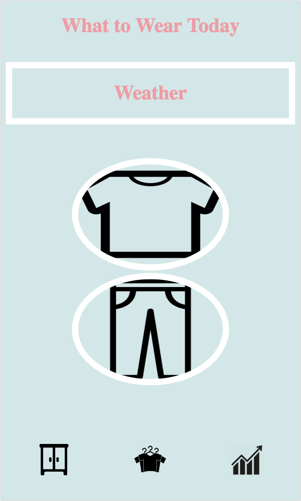
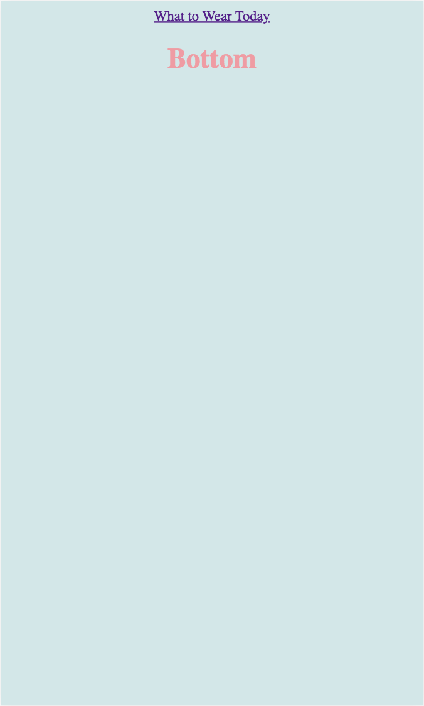
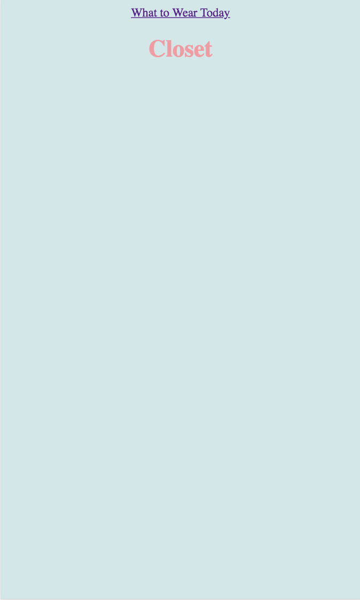
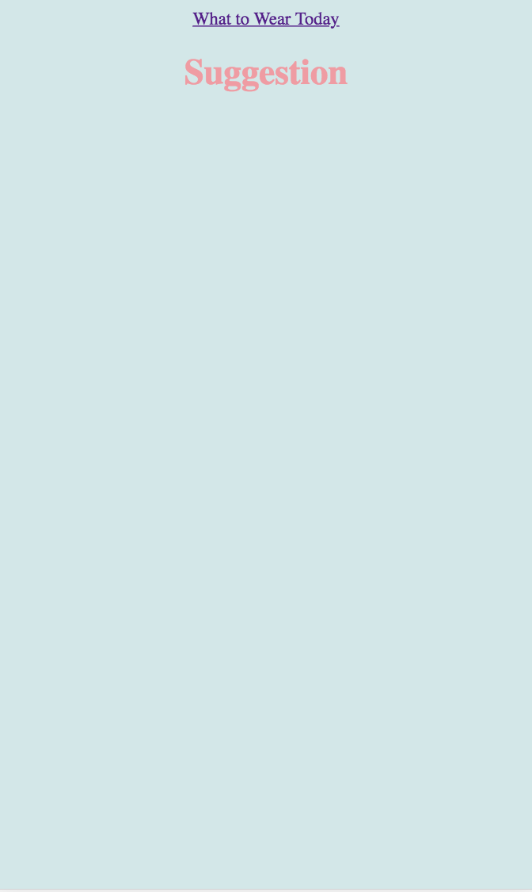
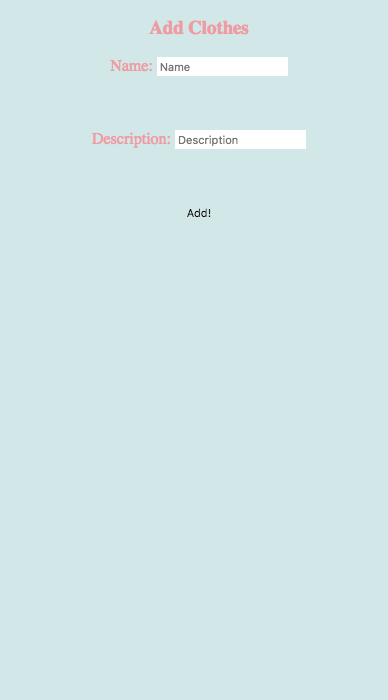

# Milestone 3

### Home Screen

This screen contains the bubble feature and small weather display from prototype 1. Additionally, we added smaller icons at the bottom to navigate around.

### Top

This screen will show the tops and their preview from prototype 2 once there's more user data.

### Bottom

This screen will show the bottoms and their preview from prototype 2 once there's more user data.

### Closet

This screen will show the closet of clothes from prototype 2.

### Suggestion

This screen from prototype 2 will show suggestions of clothes to wear based on past user wear data.

### Visualization

This screen incorporates the feature of showing worn and clean clothes from prototype 2.

### Add

This screen incorporates the feature of adding clothes, which we forgot to include in both of our prototype.
 
Our skeleton is a combination of both of our paper prototypes in milestone2.md. We used elements from both paper prototype because we realized that there were elements that were good in both paper prototypes, but both can also be improved by tweaking some things. We used the bubble feature in the first prototype because it was neat and easy for users to tap. We also put the weather on the top in a small scale (just like in prototype 1) because the weather was not the main feature of our app. We included the wardrobe option and the suggestion feature from the second prototype. We also included visualization of the wardrobe to show what can be wear and what is already worned. 
