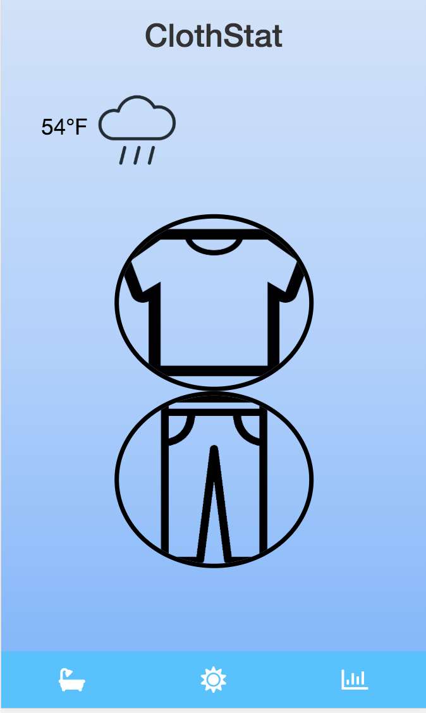
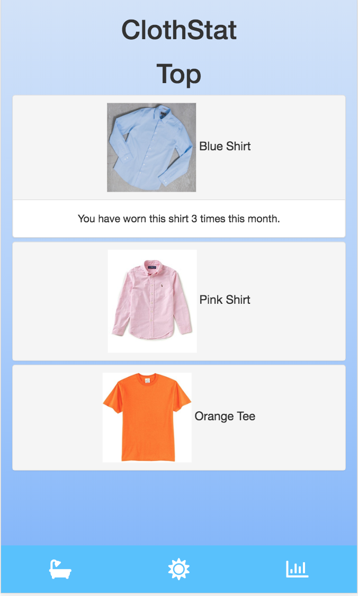
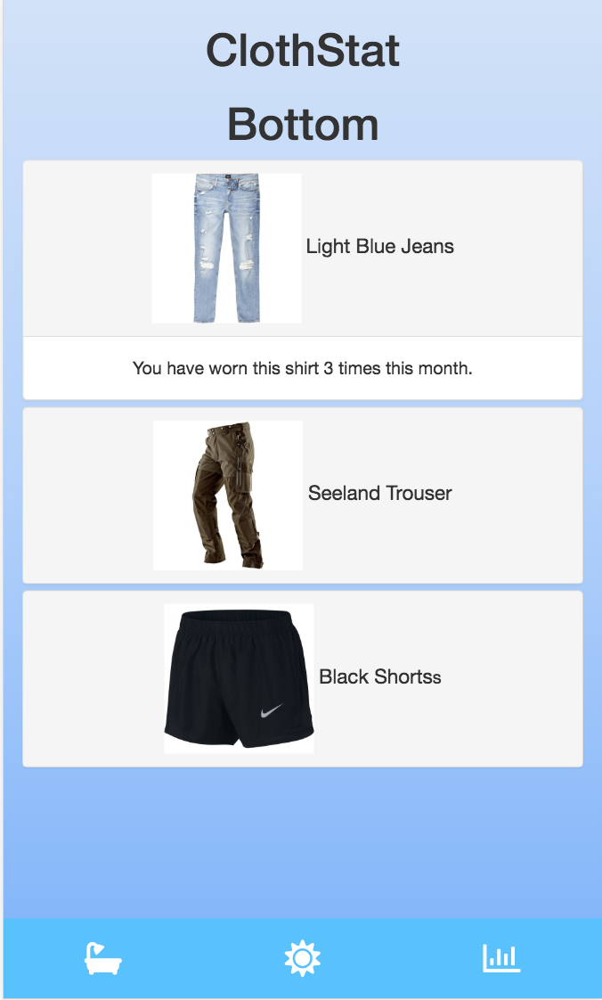
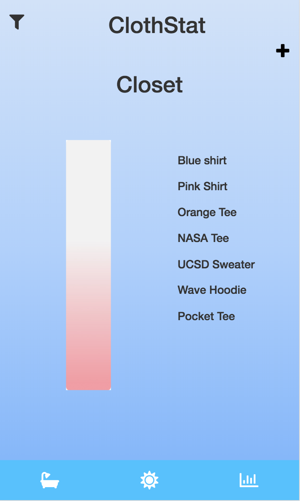
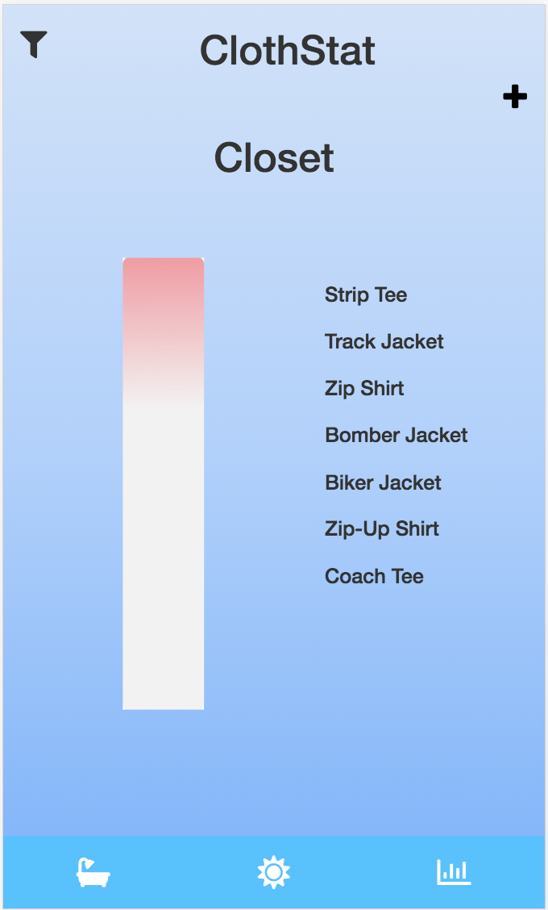
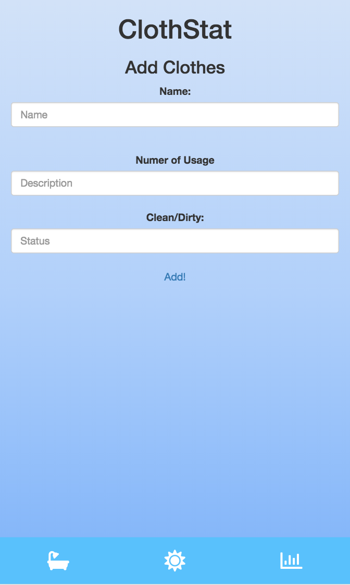
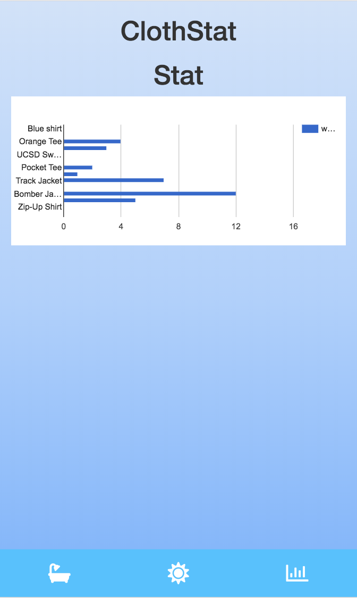

# Milestone 4

### Home Screen

The upper left corner displays weather information, which we retrieved from OpenWeatherMap API. The center two buttons corresponds to the tops and bottoms we recommend the user to wear for the day. The buttom navigation controller allow ease of access to the other features (cloth status, home page, and statistics) of this app.

### Top

This screen show the recommended tops depending on the weather and the frequency of cloth usage.

### Bottom

This screen show the recommended bottoms depending on the weather and the frequency of cloth usage.

### Closet Clean

This screen displays user's clean clothes. User can use the upper left filter button to display the dirty clothes. User can also use the upper right plus button to add clothes into his or her closet.

### Closet Dirty

This screen displays user's dirty clothes. User can use the upper left filter button to display the clean clothes. User can also use the upper right plus button to add clothes into his or her closet.

### Add

This screen contains fields user can fill out to inventorize their closet or add clothes to their closet.

### Stat

This screen shows the cloth usage frequency.

### Improvements
We added icons to minimize space usage so we can fit more contents and not make the app appear crowded. The redesign of the navigation controller at the bottom is more visually appealing and have higher contrast. We also shrunked the weather display and displayed the current weather condition at the right upper corner, because it is not the focus of our app. In addition, we added images of clothes and weather condition.

### Privacy
In order to maximize user privacy, we will first ask for the user's consent to track their location, so that we can use the OpenWeatherMap API to give the corresponding weather information. However, if the user refuses the location tracking, we will ask the user to give us a location so that we can retrieve the weather information to give clothing recommendations. We only use the user's data that the user himself or herself is willing to give us, which are the user's clothing items. So the user will have main control over what he or she wants to share to the app.
