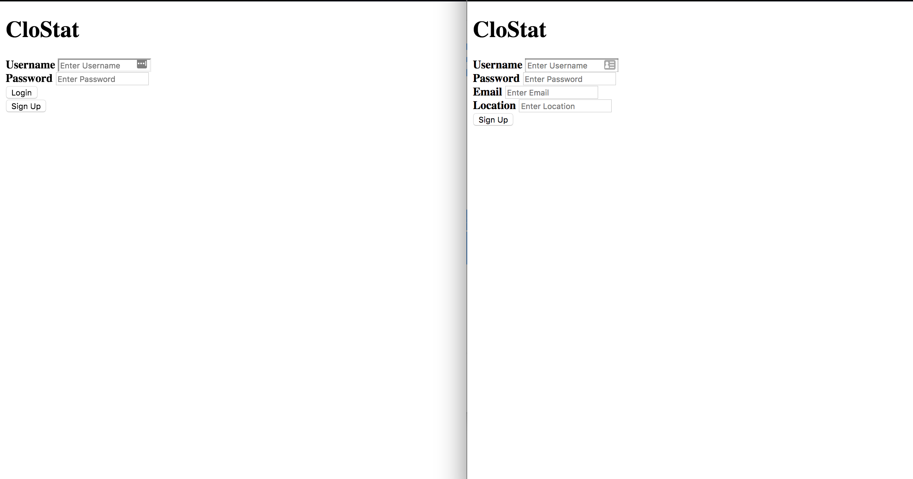
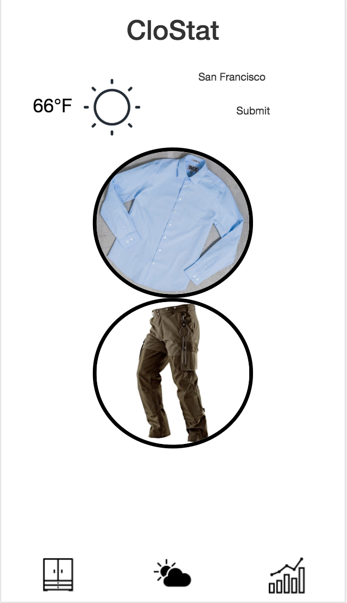
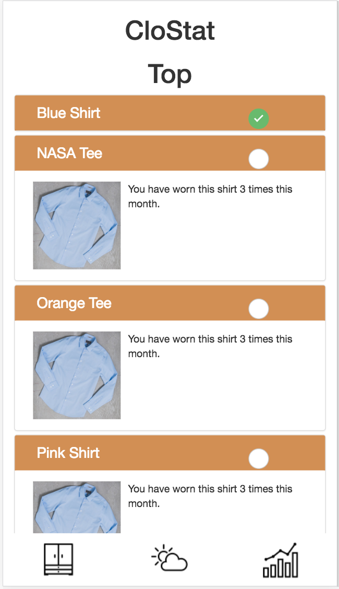
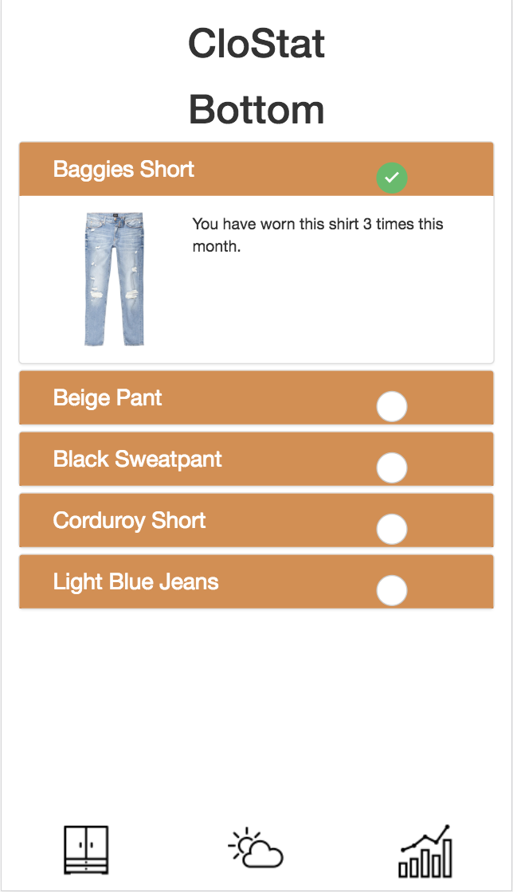
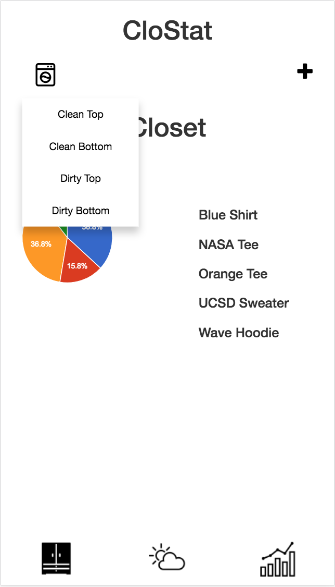
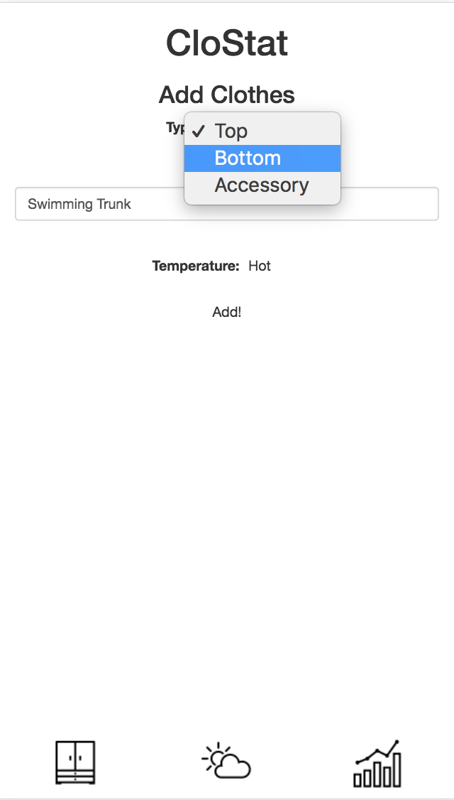
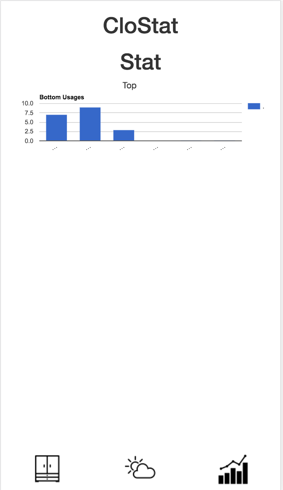

# Milestone 5

### Login and Signup

The newly created login and sign up page, which retrieves and stores data to firebase respectively. In both pages, the respective error messages have been implemented to give users the corresponding feedback depending on how they interact with the app.

### Home Screen

Improvements: Added an image to the Tops and Bottoms button. Changed icons in the navigation controller. Also added a field for the user to be able to change their location.

### Top

Improvements: Changed cell designs, and added ability to mark clothes as worned that day so that it will be mark as dirty clothes.

### Bottom

Improvements: Changed cell designs, and added ability to mark clothes as worned that day so that it will be mark as dirty clothes.

### Closet

Improvements: Added a drop down to filter the different types of clothes. Added a piechart to reflect the percentage of clean tops, clean bottoms, dirty tops, and dirty bottoms of the closet.

### Add

Improvements: Added a drop down for users to identify whether their clothes is top, bottom, or accessory. Also added a drop down for users to identify whether their clothes is worn when hot, warm, or cold.

### Stat

Improvements: Minor change in the data displayed.

### Nontrivial Actions
1) The user is able to add clothes into the database, and the new data will be displayed.
2) The user is able to change their default location so that they can see the weather of different places and get different clothing recommendations based on the new location's weather condition.