# Milestone 6

### Login
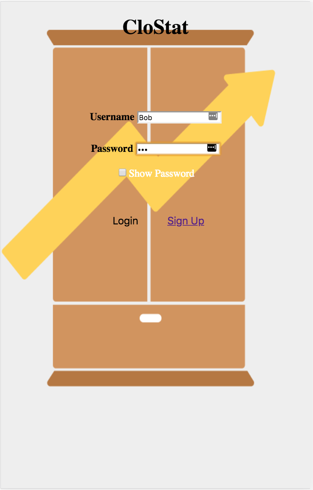
Improvements: The login screen background now contains our logo and hides the password input from people, but the user can toggle the box below to show/hide it.

### Sign Up
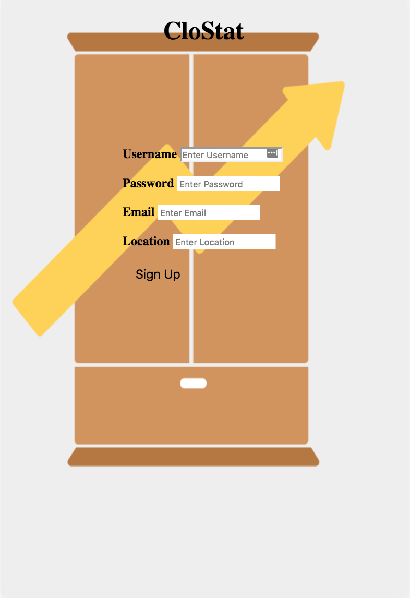
Improvement: The sign up screen background now contains our logo as the background.

### Home Screen
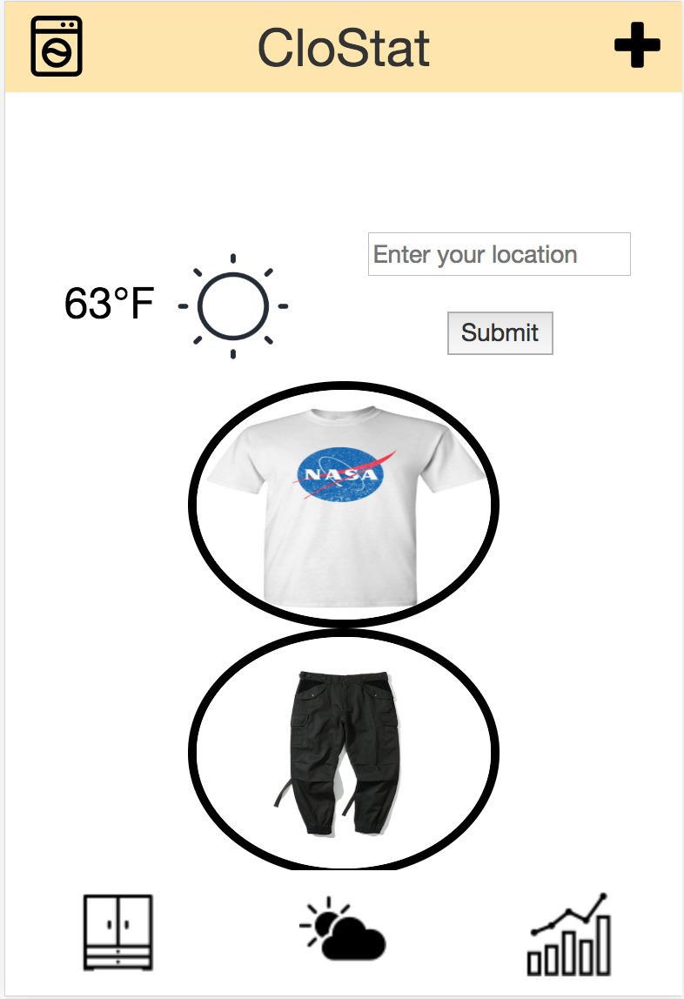
Improvements: Added color stripe on top, added add clothing feature at top right corner, added laundry feature at the top left corner, and implemented recommendation top and bottom images in the bubbles.

### Top
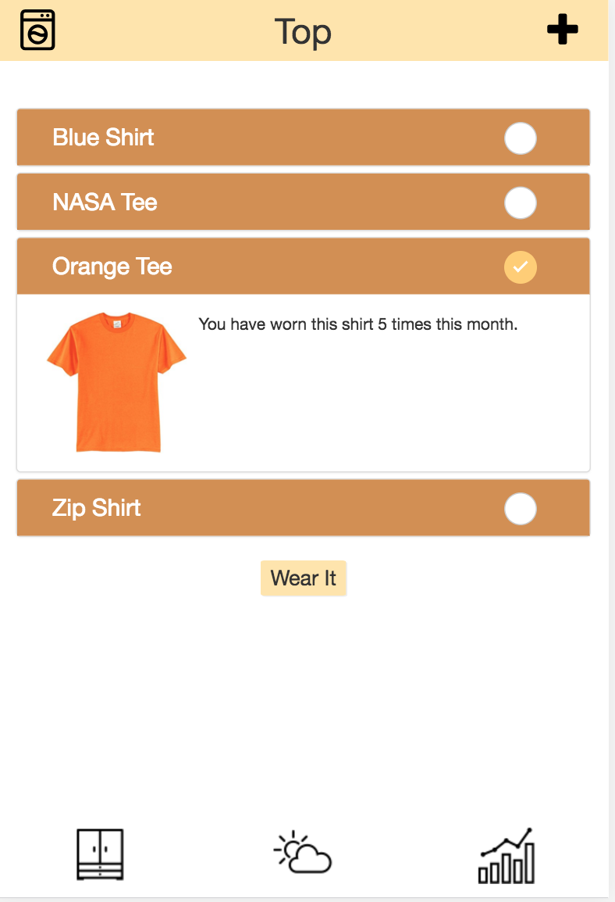
Improvements: Make the top navigation bar consistent with that of the home screen. Implemented feature to allow user to mark the clothing as the clothing they will wear for the day, and the marked clothes will be marked as dirty in the database and its usage is increased by one.

### Bottom
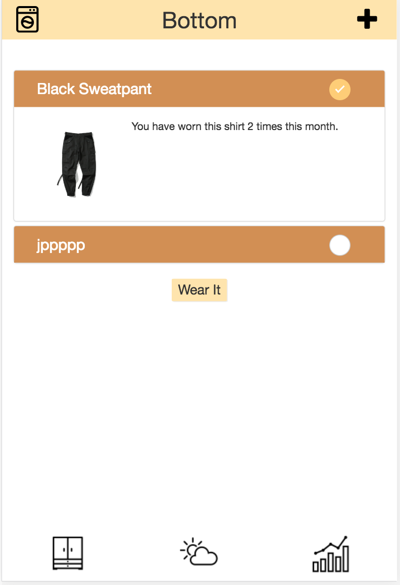
Improvements: Make the top navigation bar consistent with that of the home screen. Implemented feature to allow user to mark the clothing as the clothing they will wear for the day, and the marked clothes will be marked as dirty in the database and its usage is increased by one.

### Closet
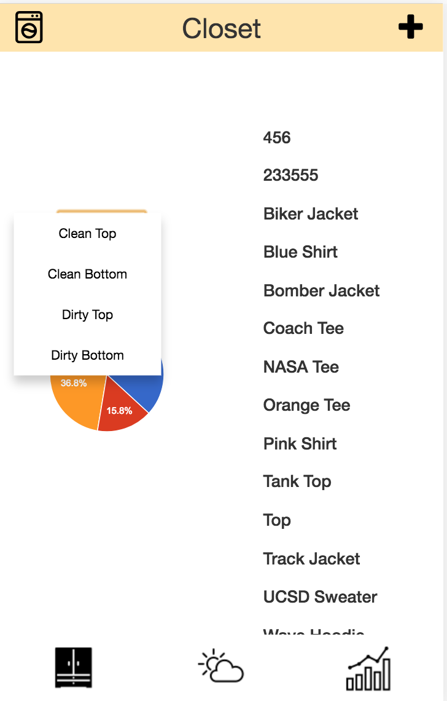
Improvement: Make the top navigation bar consistent with that of the home screen. 

### Add
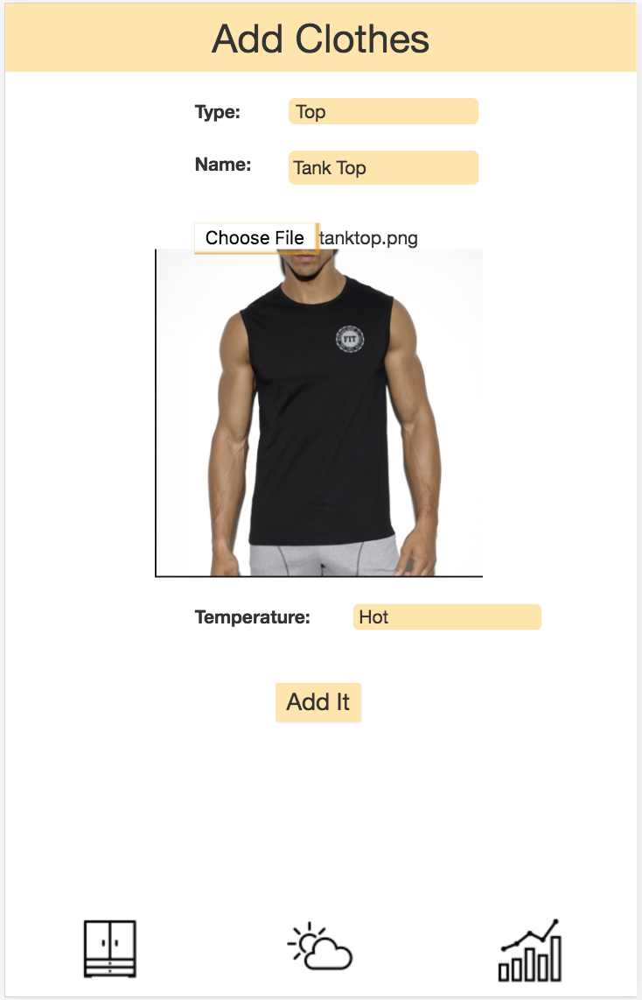
Improvements: Make the top navigation bar consistent with that of the home screen. Implemented the ability to upload image of the clothing and increased contrast of the drop down selections.

### Laundry
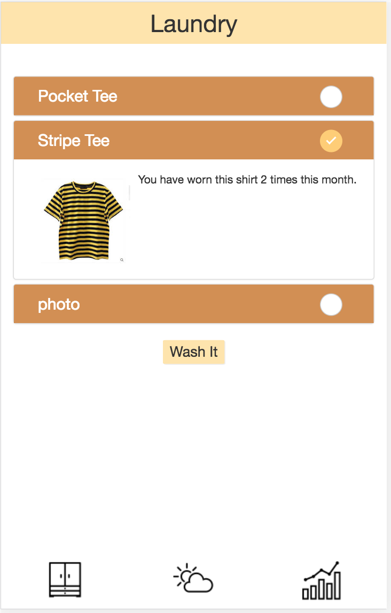
Improvemens: Added the laundry page with top navigation bar consistent with that of the home screen. Users can now mark what clothes they cleaned so that the clothes will be marked clean again in the database.

### Stat
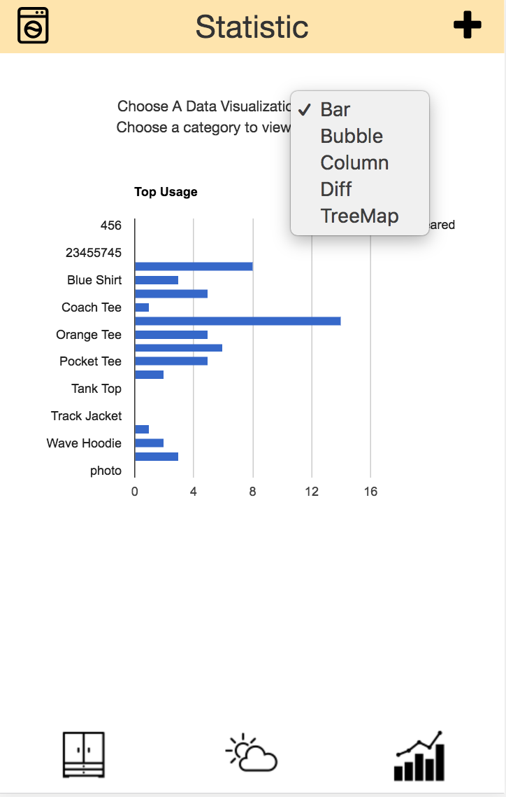
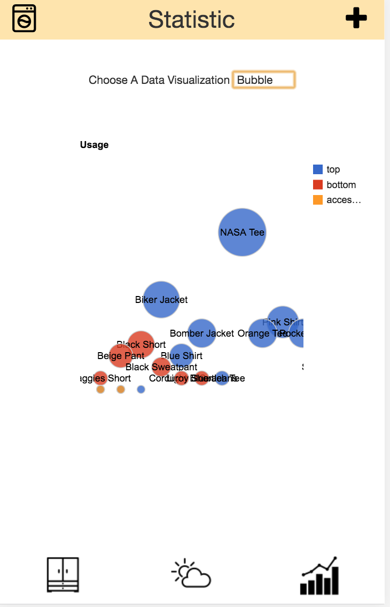
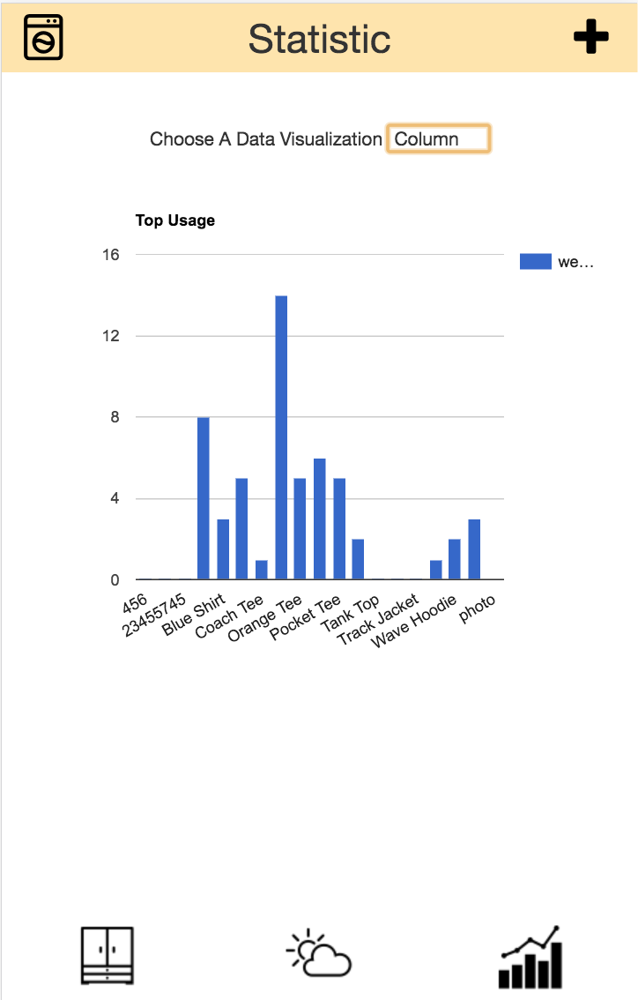
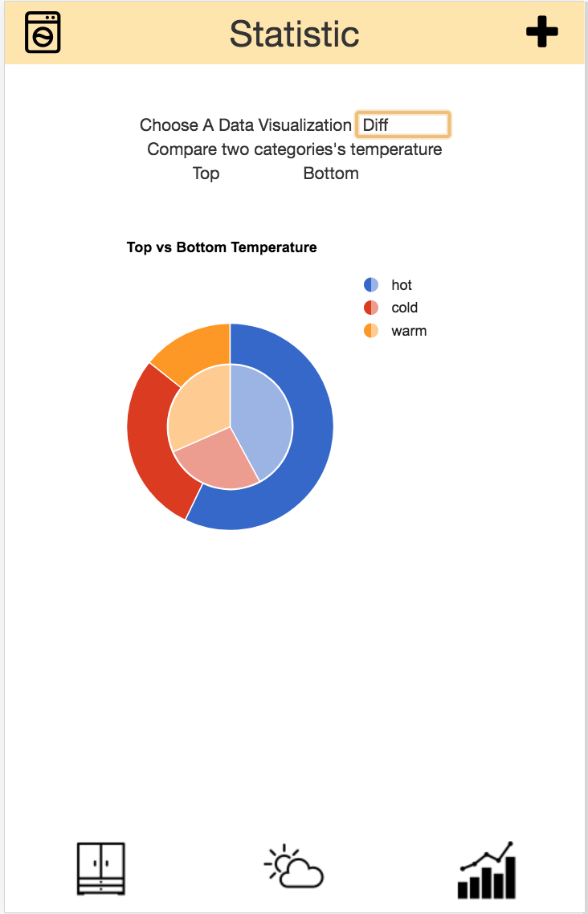
Improvements: Make the top navigation bar consistent with that of the home screen. Implemented additional data visualizations to allow the users to switch between data presented and the types of graph/table displayed.

### Data Visualization
The bar graph (image one) displays the clothing usage; the longer the bar, the more that particular clothing item was used. The bubble graph (image two) also displays the clothing usage but the size of the bubble is dependent on the usage; the bigger the bubble, the more the user wore that clothing. The column chart (image three) also displays the clothing usage, but in a column fashion rather than as a bar. The piechart (image four) compares the number of hot, warm, and cold clothing items in the user's closet.